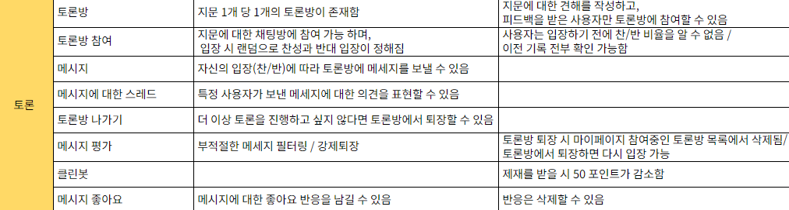

## 시리즈 소개

이 시리즈는 필자가 대학교에서 진행한 팀프로젝트를 복기하고 개선점을 찾기 위한 것이다.

프로젝트 소개는 아래 링크를 참고하길 바란다. (배포 사이트의 경우 비용 문제로 현재는 내려간 상태이다.) 
[현대인을 위한 문해력 향상 서비스, 똑똑](https://github.com/KnowckknowcK) 
내가 맡은 부분을 자세히 분석할 예정이다. 시간이 된다면 내가 맡지 않은 부분도 다루고자 한다.

## 토론방 요구사항 분석

토론방 구현을 위해 팀이 함께 분석한 요구사항은 위 표와 같다.
여기서 클린봇은 시간적 여유가 없고, 필수 기능이 아니라고 판단하여 제외하고 진행하였다.

이 글 및 앞으로의 글에서 아래 기능을 구현했던 과정을 복기하고 개선안을 고민하고자 한다.

1. 실시간 토론
2. 토론글에 대한 답글
3. 좋아요 계산 로직
4. redis 캐싱을 통한 성능 개선
5. JQPL을 활용한 쿼리 수 개선 ( N+1 문제 )

## 실시간 토론 구현하기

토론방에서 실시간 채팅방을 구현해야 했으므로 관련된 기술을 찾아보았다.

1. HTTP Long Polling
2. SSE(Server Sent Events)
3. 웹소켓과 STOMP

위와 같이 크게 총 세가지를 찾았고, 기술 선택 전 각 기술의 개념과 장단점을 정리해보았다.

## 1. HTTP Long Polling

HTTP Long Polling은 실시간 웹 애플리케이션에서 서버와 클라이언트 간의 지속적인 통신을 가능하게 하기 위해 등장한 기술이다.

### 등장 배경

기존의 HTTP 통신 방식은 클라이언트가 서버에 요청을 보내고, 서버가 응답을 보내는 단순한 요청-응답 모델로 이루어져 있다. 이 방식은 다음과 같은 문제점을 가지고 있다.

1. **지연 시간**: 클라이언트가 새로운 데이터를 확인하기 위해 주기적으로 서버에 요청을 보내는 방식(폴링)은 불필요한 네트워크 트래픽을 증가시키고 지연 시간을 발생시킨다.
2. **비효율성**: 주기적인 요청은 서버의 부하를 증가시키고, 클라이언트가 새로운 데이터를 받을 때까지 기다려야 하는 비효율성을 초래한다.

이와 같이 실시간 통신을 필요로 하는 애플리케이션에서 일반적인 HTTP 요청-응답 모델의 한계를 극복하기 위해 HTTP Long Polling이 개발되었다.

### 장점

- 실시간 데이터 통신이 가능하여 사용자 경험을 향상
- 불필요한 네트워크 트래픽을 줄여 서버 부하를 감소

### 단점

- 서버가 클라이언트의 요청을 오랜 시간 대기 상태로 유지해야 하므로, 많은 클라이언트가 접속할 경우 서버 자원이 많이 소모함
- HTTP 연결을 장시간 유지하므로 방화벽이나 프록시 서버와의 호환성 문제가 발생 가능

## 2. SSE(Server-Sent Events)

SSE(Server-Sent Events)는 클라이언트가 서버로부터 지속적으로 업데이트를 받기 위해 사용되는 기술이다. 이는 실시간 웹 애플리케이션에서 서버가 클라이언트에게 데이터를 푸시(push)하는 방식으로, HTTP 프로토콜을 사용하여 단방향 통신을 제공한다.

### 등장 배경

SSE는 실시간 데이터 업데이트를 필요로 하는 애플리케이션의 요구에 따라 등장했다.

### 장점

- **간단한 구현**: HTTP 기반이므로 설정과 구현이 비교적 간단함
- **브라우저 지원**: 주요 웹 브라우저에서 기본적으로 지원함
- **자동 재연결**: 연결이 끊어질 경우 자동으로 재연결을 시도함
- **효율적 데이터 전송**: 서버가 데이터를 푸시하므로 클라이언트가 주기적으로 요청을 보내는 방식보다 효율적임

### 단점

- **단방향 통신**: 클라이언트에서 서버로의 데이터 전송이 필요할 경우 별도의 HTTP 요청을 사용해야 함
- **한계점**: 매우 대규모의 실시간 데이터 전송에는 적합하지 않을 수 있음
- **브라우저 의존성**: 일부 구형 브라우저에서는 지원되지 않을 수 있음

## 3. 웹소켓과 STOMP

웹소켓(WebSocket)과 STOMP(Simple Text Oriented Messaging Protocol)은 실시간 통신을 가능하게 하는 기술이다.

### 웹소켓(WebSocket)

### 등장 배경

HTTP는 클라이언트-서버 간의 요청-응답 방식으로 동작하며, 클라이언트가 정보를 요청할 때만 서버가 응답을 보낸다. 웹소켓은 실시간 통신에서 위와 같은 HTTP 프로토콜의 방식의 한계를 극복하기 위해 등장했다.

### 장점

- **양방향 통신**: 클라이언트와 서버가 상호 간에 자유롭게 데이터를 주고받을 수 있음
- **낮은 오버헤드**: 초기 핸드셰이크 이후에는 헤더 정보가 거의 없기 때문에 데이터 전송 오버헤드가 낮음
- **실시간성**: 지연 시간이 적고, 실시간 데이터 전송에 적합하다.
  광범위한 지원: 대부분의 최신 브라우저와 서버에서 지원함

### 단점

- **상태 유지**: 웹소켓은 지속적인 연결을 유지하기 때문에 서버 자원이 많이 소모 가능성 존재
- **복잡성**: 구현이 상대적으로 복잡하며, 연결 관리와 오류 처리가 필요
- **방화벽 문제**: 일부 방화벽이나 프록시 서버에서 웹소켓 연결을 차단할 위험성 존재

### STOMP(Simple Text Oriented Messaging Protocol)

### 등장 배경

STOMP는 메시징 프로토콜로, 메시지 브로커와의 통신을 단순화하기 위해 등장했다. 복잡한 메시징 프로토콜에 비해 상대적으로 간단하며, 텍스트 기반으로 되어 있어 이해하고 사용하기 쉬운 편이다.

### 장점

- **간단한 프로토콜**: 텍스트 기반의 간단한 프로토콜로, 이해하고 사용하기 쉬움
- **메시지 큐 지원**: 메시지 브로커를 사용하여 메시지 큐를 통해 안정적인 메시지 송수신이 가능
- **구독/발행 모델**: 클라이언트가 특정 채널을 구독하면, 해당 채널에 메시지가 게시될 때마다 자동으로 수신
- **확장성**: 메시지 브로커를 통해 다수의 클라이언트를 효율적으로 관리 가능

### 단점

- **웹소켓 의존성**: 웹 환경에서 사용하려면 웹소켓과 함께 사용해야 함
- **추가 오버헤드**: 웹소켓 위에서 동작하기 때문에, 웹소켓 자체의 오버헤드에 더해 STOMP 프로토콜의 오버헤드가 추가될 수 있음
- **브로커 필요**: 메시지 브로커가 필요하여, 추가적인 설정과 관리가 필요

### 기술 선택

위 기술 중 내가 선택한 것은 웹소켓 및 STOMP를 활용한 방식이었는데, 그 이유는 아래와 같다.

먼저, SSE를 선택하지 않은 이유는 SSE가 서버에서 클라이언트로의 단방향 통신만 지원하기 때문이다. 실시간 채팅 애플리케이션에서는 클라이언트가 서버로 메시지를 보내는 기능이 필수적이므로, SSE는 적합하지 않다고 판단했다.

다음으로, HTTP Long Polling 방식을 배제한 이유는 효율성 문제와 관련이 있다. Long Polling 방식은 서버와 클라이언트 간의 연결을 지속적으로 유지하고 빈번한 요청을 보내기 때문에 리소스 소모가 크다. 또한, 이 방식은 실시간성을 흉내낼 뿐 실제로는 리얼 타임 방식이 아니며, 많은 사용자가 접속할 경우 서버의 부하가 증가하여 스케일링이 어려울 수 있다. 이러한 이유로 Long Polling 방식은 실시간 채팅의 요구사항을 충족시키기에 적합하지 않다고 판단했다.

이렇게 토론방 구현을 위해 웹 소켓과 STOMP를 활용하기로 했으므로 다음 글에서 그 구현 과정을 상세히 적고자 한다.
