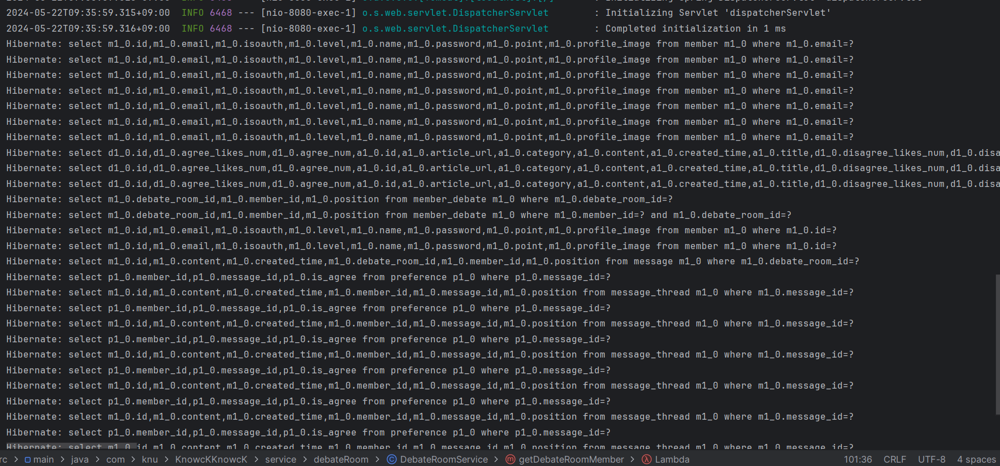
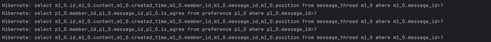
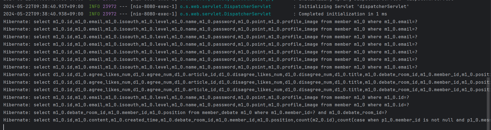

## 시리즈 소개

이 시리즈는 필자가 대학교에서 진행한 팀프로젝트를 복기하고 개선점을 찾기 위한 것이다.

프로젝트 소개는 아래 링크를 참고하길 바란다. (배포 사이트의 경우 비용 문제로 현재는 내려간 상태이다.)<br>
[현대인을 위한 문해력 향상 서비스, 똑똑](https://github.com/KnowckknowcK)<br>
내가 맡은 부분을 자세히 분석할 예정이다. 시간이 된다면 내가 맡지 않은 부분도 다루고자 한다.

아래는 앞으로 다룰 내용을 개략적으로 정리한 것으로 추후 글을 작성하며 구체화해갈 예정이다.

## 개요

이번 글에서는 프로젝트 진행 중 JPQL을 직접 작성하여 쿼리 최적화를 진행한 과정 및 결과를 다루고자 한다.

## 쿼리 최적화의 필요성

토론방 기능 중 특정 토론방에 참여한 참여자와 메세지 목록을 가져오는 기능이 있었다.
이때 가져와야 하는 데이터는 해당 토론방에 존재하는 메세지, 참여자의 프로질 사진, 메세지 답글 수, 좋아요 표시 수이다.
각 필드명은 정확히 알지못하더라도 SQL을 작성한다면 아래와 같은 느낌일 것이다.

```SQL
SELECT
    m.id AS message_id,
    m.member_profile_image,
    COUNT(mt.id) AS message_thread_count,
    COUNT(p.id) AS preference_count
FROM
    message m
    LEFT JOIN message_thread mt
    ON m.id = mt.message_id
    LEFT JOIN preference p
    ON m.id = p.message_id
WHERE
    m.debate_room_id = debateRoom.ID
GROUP BY
    m.id,
    m.member_profile_image;

```

원래라면 위처럼 한번의 쿼리로 원하는 정보를 전부 가져올 수 있다.
하지만 JPQL 없이 JPA를 활용하여 가져올 경우 메세지, 참여자 정보, 메세지 답글 수, 좋아요 수를 가져오기 위해 각각 SQL 쿼리를 보내야 했다.

실제로 한 토론방에 참여자가 2명, 메세지가 8개, 좋아요는 없을 때 SQL 쿼리 수는 아래와 같이 총 33회가 나온다.




토론방 정보를 불러올 때마다 매번 위와 같은 쿼리 요청이 필요하므로 비효율적이다.
또 토론방 내 참여자, 메세지 수, 메세지 답글 수가 늘어날수록 SQL 쿼리 수가 크게 증가하므로 쿼리 최적화를 위한 해결책이 필요하다.

## 쿼리 최적화 전략

나는 JPA에서는 JPQL을 활용하여 SQL 쿼리 문으로 변환하여 사용하는 점을 이용해, 직접 JPQL을 작성하는 방법으로 문제를 해결했다.

아래와 같이 프로젝트에서 JPA 활용이 필요한 부분들에 JPQL을 적용해보았다.

### 메세지 리스트 가져오기

```JAVA
    @Query("SELECT m, COUNT(mt), COUNT(p), m.member.profileImage " +
            "FROM Message m " +
            "LEFT JOIN m.messageThreads mt " +
            "LEFT JOIN m.preferences p " +
            "WHERE m.debateRoom = :debateRoom " +
            "GROUP BY m.id, m.member.profileImage")
    List<Object[]> findMessagesWithCounts(@Param("debateRoom") DebateRoom debateRoom);
```

## 쿼리 최적화 결과



참여자 2명, 메세지 8개가 있는 토론방 정보를 가져오기 위해 JPQL 적용 전에는 총 33회의 쿼리를 보내야 했지만, 적용 후에는 14회의 쿼리로 해결할 수 있었다.

이는 Message에 있는 Preferecne와 Thread의 개수를 세기 위해 추가로 쿼리를 보내야했지만, JPQL로 Message를 가져올 때 같이 불러오기 때문에 불필요한 쿼리가 없어졌기 때문이다.

결과적으로 필요 쿼리를 이전에 비해 약 42% 수준까지 줄일 수 있었다. 이 차이는 토론방에 메세지나 참여자가 많아질수록 더 커지게 되므로 이 감소치는 유의미하다고 볼 수 있다.

## 마무리

지금까지 JPQL을 통해 쿼리 최적화를 진행해 보았다.
SQL을 작성할 줄 알면 JPQL 작성도 크게 어렵지 않은데다 쿼리 수 감소는 성능 향상과도 연결되어 있으므로 적극 활용하는 것이 좋다는 생각이 들었다.

다음 글에는 JPQL을 통해 N+1 문제를 해결한 과정을 간단히 다루고자 한다.
